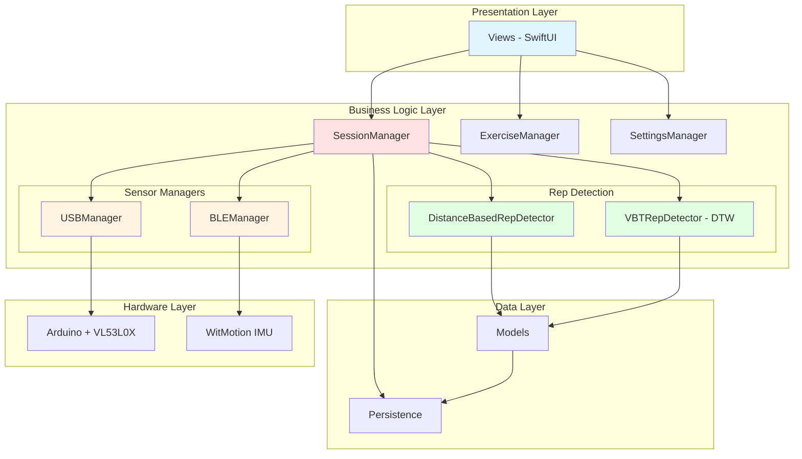
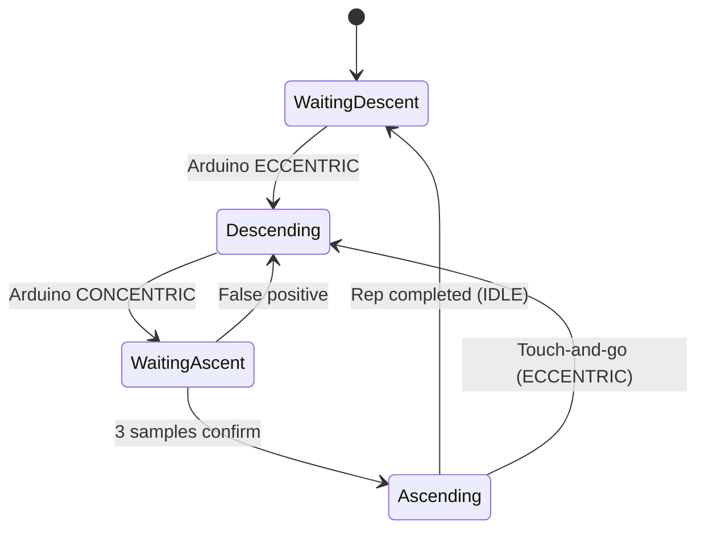
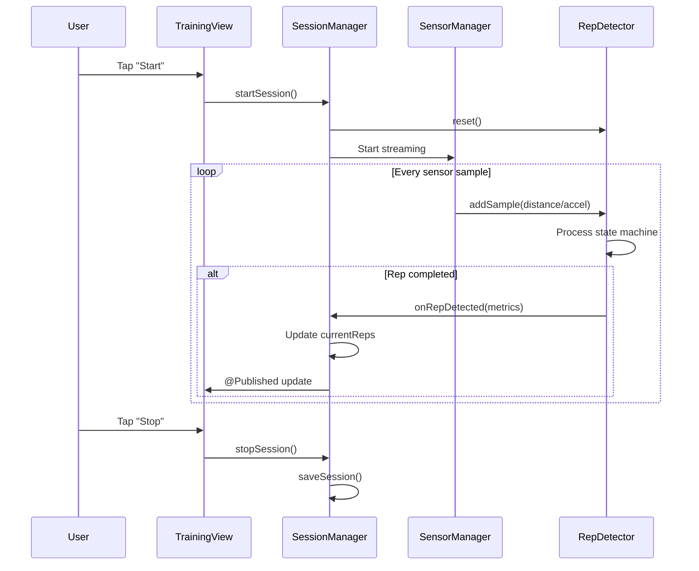

# Capitolo 1: Architettura del Sistema

## 1.1 Introduzione

VBT Tracker implementa un'architettura **MVVM (Model-View-ViewModel)** combinata con **Protocol-Oriented Programming** per massimizzare modularità, testabilità e riusabilità del codice.

L'applicazione gestisce due tipologie di sensori hardware:
1. **Arduino Nano 33 BLE** con sensore laser VL53L0X (connessione USB)
2. **WitMotion WT901BLE/WT9011DCL** IMU 9-axis (connessione Bluetooth LE)

## 1.2 Architettura ad Alto Livello



## 1.3 Pattern Architetturali

### 1.3.1 MVVM (Model-View-ViewModel)

**Motivazione**: SwiftUI richiede una separazione netta tra UI e logica di business.

**Implementazione**:

```swift
// MODEL
struct Rep: Codable, Identifiable {
    let id: UUID
    let meanVelocity: Double
    let peakVelocity: Double
    let velocityLossFromFirst: Double
}

// VIEW-MODEL (ObservableObject)
final class SessionManager: ObservableObject {
    @Published var currentReps: [Rep] = []
    @Published var isRecording: Bool = false

    func startSession() { /* business logic */ }
    func stopSession() { /* business logic */ }
}

// VIEW
struct TrainingSessionView: View {
    @StateObject private var sessionManager = SessionManager.shared

    var body: some View {
        VStack {
            Text("Reps: \(sessionManager.currentReps.count)")
            Button("Start") { sessionManager.startSession() }
        }
    }
}
```

**Vantaggi**:
- ✅ Testabilità: business logic separata dalla UI
- ✅ Reattività: @Published trigger automatic UI updates
- ✅ Riusabilità: ViewModels indipendenti dalle Views

### 1.3.2 Protocol-Oriented Programming

**Problema**: Supportare due sensori hardware diversi senza duplicazione codice.

**Soluzione**: Protocol `SensorDataProvider`

```swift
// PROTOCOL
protocol SensorDataProvider {
    var acceleration: [Double] { get }
    var angularVelocity: [Double] { get }
    var angles: [Double] { get }
}

// IMPLEMENTAZIONI
final class BLEManager: SensorDataProvider {
    // WitMotion implementation
}

final class USBManager: SensorDataProvider {
    // Arduino implementation
}

// CONSUMATORE
final class VBTRepDetector {
    private var sensorProvider: SensorDataProvider?

    func setSensor(_ provider: SensorDataProvider) {
        self.sensorProvider = provider
    }
}
```

**Vantaggi**:
- ✅ Polimorfismo: algoritmi funzionano con qualsiasi sensore
- ✅ Estensibilità: aggiungere nuovi sensori senza modificare algoritmi
- ✅ Dependency Injection: facilita testing

### 1.3.3 Singleton Pattern (Managed)

I Manager critici usano Singleton per garantire stato condiviso:

```swift
final class SessionManager: ObservableObject {
    static let shared = SessionManager()
    private init() { /* prevent multiple instances */ }
}
```

**Quando usato**:
- ✅ `SessionManager`: stato sessione unico
- ✅ `ExerciseManager`: catalogo esercizi condiviso
- ✅ `SettingsManager`: configurazione globale
- ✅ `BLEManager`: gestione bluetooth centralizzata

**Quando evitato**:
- ❌ Views (create/destroy on navigation)
- ❌ Rep detectors (multiple instances possibili)

## 1.4 Struttura dei Moduli

### 1.4.1 Models Layer

**Responsabilità**: Definire strutture dati e business entities.

```
Models/
├── Exercise.swift          # Esercizio (nome, ROM, velocity ranges)
├── Rep.swift               # Singola ripetizione
├── TrainingSession.swift   # Sessione completa
├── CalibrationData.swift   # Dati calibrazione sensore
└── PatternSequence.swift   # Pattern learned per DTW
```

**Caratteristiche**:
- `Codable` per serializzazione JSON
- `Identifiable` per SwiftUI lists
- `Hashable` per Set e Dictionary
- `Equatable` per comparazioni

**Esempio - Exercise.swift**:

```swift
struct Exercise: Identifiable, Codable, Hashable {
    let id: UUID
    let name: String
    let category: ExerciseCategory
    let icon: String
    let defaultROM: Double              // Range of Motion (metri)
    let romTolerance: Double            // Tolleranza ROM (%)
    let velocityRanges: VelocityRanges  // Zone velocità scientifiche
    let movementProfile: MovementProfile // Parametri movimento

    // Catalogo predefinito
    static let all: [Exercise] = [
        .benchPress, .squat, .deadlift, .overheadPress, ...
    ]
}
```

### 1.4.2 Managers Layer

**Responsabilità**: Business logic e orchestrazione.

#### SessionManager.swift

**Ruolo**: Coordina l'intera sessione di allenamento.

```swift
final class SessionManager: ObservableObject {
    // MARK: - Published State
    @Published var currentReps: [RepData] = []
    @Published var isRecording = false
    @Published var sessionState: SessionState = .idle

    // MARK: - Dependencies
    let repDetector: VBTRepDetector
    let bleManager: BLEManager
    let usbManager: USBManager

    // MARK: - Core Functions
    func startSession() {
        repDetector.reset()
        currentReps.removeAll()
        isRecording = true
        sessionState = .recording
    }

    func stopSession() {
        isRecording = false
        sessionState = .reviewing
        saveSession()
    }

    private func saveSession() {
        let session = TrainingSession(
            id: UUID(),
            date: Date(),
            exercise: ExerciseManager.shared.selectedExercise,
            reps: currentReps,
            notes: ""
        )
        // Persist to UserDefaults/CoreData
    }
}
```

**Responsabilità**:
1. Gestire stato sessione (idle → recording → reviewing → saved)
2. Coordinare rep detector e sensor manager
3. Applicare velocity loss stop criteria
4. Salvare/caricare sessioni

#### BLEManager.swift

**Ruolo**: Gestire connessione Bluetooth Low Energy con WitMotion.

```swift
final class BLEManager: NSObject, ObservableObject, SensorDataProvider {
    // MARK: - CoreBluetooth
    private var central: CBCentralManager!
    private var connectedPeripheral: CBPeripheral?
    private var dataCharacteristic: CBCharacteristic?

    // MARK: - Published State
    @Published var isConnected = false
    @Published var sampleRateHz: Double? = nil

    // MARK: - Sensor Data
    @Published var acceleration: [Double] = [0,0,0]
    @Published var angularVelocity: [Double] = [0,0,0]
    @Published var angles: [Double] = [0,0,0]

    // MARK: - Core Functions
    func startScanning() { /* ... */ }
    func connect(to peripheral: CBPeripheral) { /* ... */ }
    func disconnect() { /* ... */ }

    // MARK: - CBCentralManagerDelegate
    func centralManager(_ central: CBCentralManager,
                       didDiscover peripheral: CBPeripheral, ...) {
        // Handle device discovery
    }

    // MARK: - CBPeripheralDelegate
    func peripheral(_ peripheral: CBPeripheral,
                   didUpdateValueFor characteristic: CBCharacteristic, ...) {
        // Parse WitMotion packets (0x55 0x61 format)
        parseWitMotionPacket(data)
    }
}
```

**Caratteristiche**:
- ✅ Supporto dual-model (WT901BLE, WT9011DCL)
- ✅ Auto-reconnection
- ✅ Sample rate estimation
- ✅ Packet type logging
- ✅ Calibration support

#### USBManager.swift

**Ruolo**: Gestire connessione seriale USB con Arduino.

```swift
final class USBManager: ObservableObject, SensorDataProvider {
    // MARK: - ORSSerial
    private var serialPort: ORSSerialPort?
    private let serialPortManager = ORSSerialPortManager.shared()

    // MARK: - Published State
    @Published var isConnected = false
    @Published var availablePorts: [ORSSerialPort] = []

    // MARK: - Sensor Data (from Arduino)
    @Published var distance: Double = 0.0       // mm
    @Published var movementState: MovementState = .idle
    @Published var acceleration: [Double] = [0,0,0]  // From IMU

    // MARK: - Core Functions
    func connect(to port: ORSSerialPort) { /* ... */ }
    func disconnect() { /* ... */ }

    // MARK: - ORSSerialPortDelegate
    func serialPort(_ serialPort: ORSSerialPort,
                   didReceive data: Data) {
        // Parse Arduino protocol
        // Format: "D:<distance>,S:<state>,A:<ax>,<ay>,<az>\n"
        parseArduinoData(data)
    }
}
```

**Protocollo Arduino**:
```
D:523.5,S:IDLE,A:0.12,-0.05,9.81
D:520.2,S:ECCENTRIC,A:0.15,-0.08,9.75
D:135.8,S:CONCENTRIC,A:-0.22,0.11,10.20
```

### 1.4.3 Rep Detection Layer

Due strategie diverse per due sensori diversi.

#### DistanceBasedRepDetector.swift

**Per**: Arduino + VL53L0X laser
**Strategia**: State machine basata su distanza assoluta



**Parametri Adattivi**:

```swift
var lookAheadSamples: Int {
    let targetVelocity = SettingsManager.shared.targetMeanVelocity
    switch targetVelocity {
    case 0..<0.30:   return 10  // Forza Massima (lento)
    case 0.30..<0.50: return 7  // Forza
    case 0.50..<0.75: return 5  // Forza-Velocità
    case 0.75..<1.00: return 3  // Velocità (veloce!)
    default:          return 2  // Velocità Massima
    }
}
```

**Vedi**: [Capitolo 2](./02-algoritmi-rep-detection.md#distance-based) per dettagli algoritmo.

#### VBTRepDetector.swift

**Per**: WitMotion IMU
**Strategia**: DTW (Dynamic Time Warping) + Pattern Library

**Vedi**: [Capitolo 2](./02-algoritmi-rep-detection.md#dtw-based) per dettagli algoritmo.

### 1.4.4 Views Layer

**Struttura**:

```
Views/
├── Training/
│   ├── TrainingSessionView.swift      # Main training screen
│   ├── RepReviewView.swift            # Review reps before saving
│   └── TrainingSummaryView.swift      # Session summary + export
├── Settings/
│   ├── SettingsView.swift             # Main settings
│   ├── SensorConnectionView.swift     # BLE/USB connection
│   └── VelocityRangesEditorView.swift # Edit velocity zones
├── History/
│   └── HistoryView.swift              # Past sessions
└── Components/
    ├── VelocityGaugeView.swift        # Real-time velocity gauge
    ├── RepCounterView.swift           # Rep counter badge
    └── VelocityZoneIndicator.swift    # Current zone indicator
```

## 1.5 Data Flow

### 1.5.1 Training Session Flow



### 1.5.2 Sensor Data Pipeline

```mermaid
graph LR
    A[Hardware Sensor] -->|BLE/USB| B[Manager]
    B -->|Parse Protocol| C[Raw Data]
    C -->|Calibration| D[Calibrated Data]
    D -->|Smoothing| E[Filtered Data]
    E -->|Rep Detector| F[State Machine]
    F -->|Validation| G[Rep Metrics]
    G -->|UI Update| H[@Published]

    style A fill:#ffe1e1
    style B fill:#fff4e1
    style C fill:#e1ffe1
    style D fill:#e1ffe1
    style E fill:#e1ffe1
    style F fill:#e1f5ff
    style G fill:#e1f5ff
    style H fill:#f0e1ff
```

## 1.6 Thread Safety e Concorrenza

### 1.6.1 Problemi di Concorrenza

**Scenario**: Sensori inviano dati a ~50Hz, UI aggiorna a 60 FPS, algoritmi processano in background.

**Rischi**:
- Race conditions su `currentReps`
- UI freeze se processing su main thread
- Data corruption durante save

### 1.6.2 Soluzioni Implementate

**1. Serial Queue per Rep Detector**:

```swift
final class DistanceBasedRepDetector {
    private let queue = DispatchQueue(
        label: "com.vbttracker.repdetector",
        qos: .userInitiated
    )

    func addSample(_ distance: Double, state: MovementState) {
        queue.async { [weak self] in
            self?.processInternal(distance, state)
        }
    }
}
```

**2. Main Queue per UI Updates**:

```swift
func onRepDetected(_ metrics: RepMetrics) {
    DispatchQueue.main.async {
        self.currentReps.append(RepData(from: metrics))
    }
}
```

**3. Actor Pattern (Swift 5.5+)**:

```swift
actor SafeSessionStorage {
    private var sessions: [TrainingSession] = []

    func add(_ session: TrainingSession) {
        sessions.append(session)
    }

    func getAll() -> [TrainingSession] {
        return sessions
    }
}
```

## 1.7 Persistenza Dati

### 1.7.1 Strategie di Persistenza

| Tipo Dato | Storage | Formato | Motivazione |
|-----------|---------|---------|-------------|
| Settings | UserDefaults | Key-Value | Semplice, veloce |
| Sessions | UserDefaults | JSON | Prototyping rapido |
| Exercises | Hardcoded | Swift structs | Catalogo statico |
| Patterns | UserDefaults | JSON | Machine learning data |
| Calibrations | UserDefaults | JSON | Sensor-specific |

### 1.7.2 Esempio - Save Session

```swift
extension SettingsManager {
    func saveSession(_ session: TrainingSession) {
        var sessions = savedSessions
        sessions.append(session)

        if let encoded = try? JSONEncoder().encode(sessions) {
            UserDefaults.standard.set(encoded, forKey: "savedSessions")
        }
    }

    var savedSessions: [TrainingSession] {
        guard let data = UserDefaults.standard.data(forKey: "savedSessions"),
              let decoded = try? JSONDecoder().decode([TrainingSession].self, from: data)
        else { return [] }
        return decoded
    }
}
```

**Limitazioni**:
- ⚠️ UserDefaults limitato a ~4MB
- ⚠️ No query complesse
- ⚠️ No relazioni tra entità

**Migrazione Futura**: CoreData o SwiftData per app production.

## 1.8 Dependency Injection

### 1.8.1 Problema

Testing con hardware reale è lento e inaffidabile.

### 1.8.2 Soluzione

**Mock Sensor Provider**:

```swift
final class MockSensorProvider: SensorDataProvider {
    var acceleration: [Double] = [0, 0, 9.81]
    var angularVelocity: [Double] = [0, 0, 0]
    var angles: [Double] = [0, 0, 0]

    func simulateRep() {
        // Simulate eccentric phase
        for i in 0..<20 {
            acceleration = [0, 0, 9.81 + Double(i) * 0.1]
            // Trigger detector
        }
        // Simulate concentric phase
        for i in 0..<15 {
            acceleration = [0, 0, 9.81 - Double(i) * 0.15]
        }
    }
}

// In tests
func testRepDetection() {
    let mockSensor = MockSensorProvider()
    let detector = VBTRepDetector()
    detector.setSensor(mockSensor)

    mockSensor.simulateRep()

    XCTAssertEqual(detector.detectedReps.count, 1)
}
```

## 1.9 Vantaggi dell'Architettura

| Aspetto | Beneficio |
|---------|-----------|
| **Modularità** | Componenti indipendenti, facilmente sostituibili |
| **Testabilità** | Protocol-based mocking, dependency injection |
| **Estensibilità** | Nuovi sensori/algoritmi senza modifiche core |
| **Manutenibilità** | Separazione concerns, codice auto-documentante |
| **Performance** | Threading appropriato, caching intelligente |
| **Riusabilità** | Manager Singleton, Protocol conformance |

## 1.10 Trade-offs e Limitazioni

### 1.10.1 Singleton Overuse

**Pro**: Stato condiviso semplice
**Contro**: Testing difficile, accoppiamento implicito

**Mitigazione**: Usare Protocol + DI per componenti critici.

### 1.10.2 UserDefaults per Sessioni

**Pro**: Setup zero, sviluppo rapido
**Contro**: Limite 4MB, no query

**Mitigazione**: Piano migrazione a CoreData.

### 1.10.3 Main Thread UI Updates

**Pro**: SwiftUI requirement
**Contro**: Possibili lag con molti update

**Mitigazione**: Throttling, batching updates.

---

**Next**: [Capitolo 2 - Algoritmi di Rilevamento Ripetizioni](./02-algoritmi-rep-detection.md)
